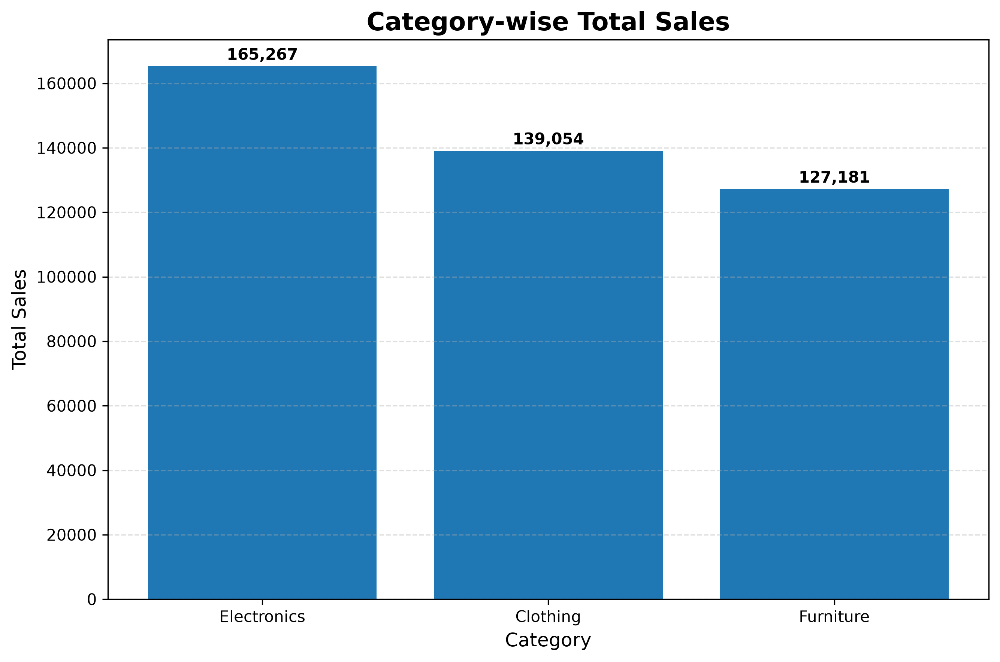
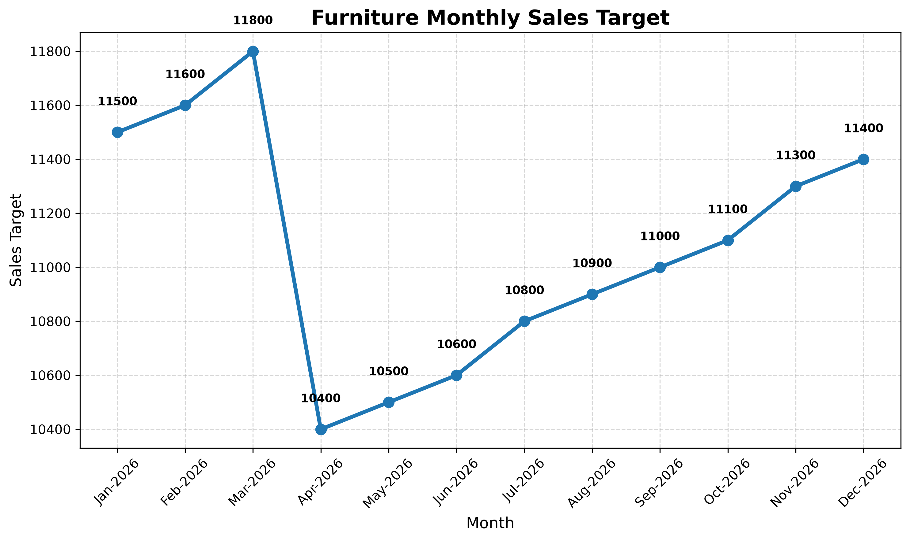
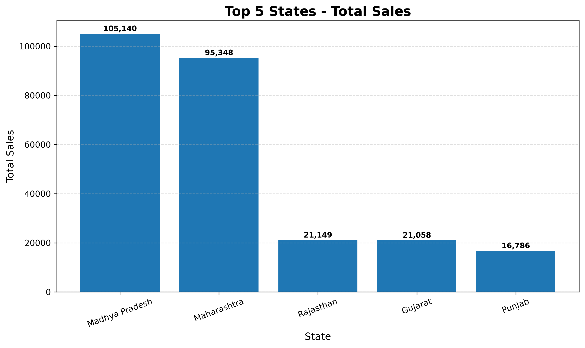

# 📊 Jar Growth Data Analysis

Professional Sales Data Analysis Project developed using Python, Pandas, and Matplotlib as part of the Jar Growth Internship Assignment.

This project analyzes sales performance, profitability, monthly sales targets, and regional business performance to generate actionable business insights using real-world datasets.


## 📸 Project Screenshots
### Category-wise Total Sales


### Furniture Monthly Target Trend


### Regional Sales Performance



## 📌 Project Overview

The objective of this project is to analyze business sales data and identify meaningful insights that can support business decision-making.

The analysis includes:

- Category-wise Sales Analysis
- Profitability Analysis
- Monthly Target Achievement Analysis
- Regional Sales Performance
- Business Recommendations

## ⭐ Project Highlights

✔ Category-wise Sales Analysis

✔ Profitability Analysis

✔ Monthly Target Achievement Analysis

✔ Regional Sales Performance

✔ Professional Data Visualizations

✔ Business Recommendations

✔ Recruiter-Friendly Documentation

✔ Portfolio-Ready Project Structure

## ✨ Features

- Data Cleaning and Validation

- Dataset Merging using Pandas

- Category-wise Sales Analysis

- Profit Margin Calculation

- Monthly Target Trend Analysis

- Regional Performance Analysis

- Business Insight Generation

- Professional Charts using Matplotlib

- Clean Folder Structure

- Exportable Reports

## 🛠 Tech Stack

- Python

- Pandas

- Matplotlib

- OpenPyXL

- Microsoft Excel

- Microsoft Word

- Git

- GitHub

## 📂 Project Structure

```text
jar-growth-data-analysis/
│
├── data/
│   ├── List_of_Orders.xlsx
│   ├── Order_Details.xlsx
│   └── Sales_target.xlsx
│
├── charts/
│   ├── category_sales.png
│   ├── furniture_target_trend.png
│   └── regional_sales.png
│
├── Report/
│   ├── Jar_Growth_Intern_Assignment_Report.docx
│   └── Jar_Growth_Intern_Assignment.pdf
│
├── assignment.py
├── requirements.txt
├── README.md
└── .gitignore
```
## 🚀 Installation

Clone the repository

```bash
git clone https://github.com/soniyaritgithub/jar-growth-data-analysis.git
```

Move into the project folder

```bash
cd jar-growth-data-analysis
```

Install dependencies

```bash
pip install -r requirements.txt
```

Run the project

```bash
python assignment.py
```
## 📊 Generated Outputs

The project automatically generates:

- Category-wise Sales Report

- Profitability Summary

- Monthly Target Trend Analysis

- Regional Performance Summary

- Business Insights

- Professional Charts

- Word Report

- PDF Report

## 📚 Key Learnings

During this project I learned:

- Data Cleaning

- Data Analysis using Pandas

- Business KPI Analysis

- Data Visualization

- Python Project Structure

- Business Reporting

- Git & GitHub Workflow

## 🚀 Future Improvements

- Interactive Dashboard using Streamlit
- Power BI Dashboard
- Automated PDF Report Generation
- SQL Database Integration
- Business KPI Dashboard

## 👩‍💻 Author

**Sunidhi Shinde**

Python Developer | Data Analytics Enthusiast

GitHub:
https://github.com/soniyaritgithub

LinkedIn:
https://www.linkedin.com/in/sunidhishinde/
